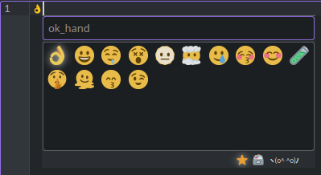
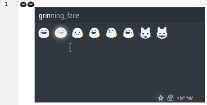
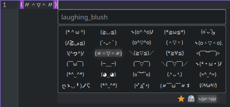

# I'm Emoji Picker

an emoji picker compatible with linux systems using either XServer or Wayland with either Fcitx5 or IBus.
You could also say that the **im** in `im-emoji-picker` stands for **input method** 😉.
I'm basically using the same systems some people use to type Japanese or Chinese characters with a western keyboard.

This project took heavy inspiration from the "predecessor" [https://github.com/GaZaTu/x11-emoji-picker](https://github.com/GaZaTu/x11-emoji-picker).

## Screenshots 😮

*Wayland support (Arch Linux with Sway (Wayland) and Fcitx5):*



*System emoji font support (openSUSE 15.1 with KDE (XServer) and IBus):*



*Kaomoji support (EndeavourOS with KDE (XServer) and Fcitx5):*



## Motivation 🤔

### Original Motivation ([x11-emoji-picker](https://github.com/GaZaTu/x11-emoji-picker#motivation-))

I switched from Windows 10 to Linux at work and missed filling my emails with emojis. ~~(the KDE version we use doesn't have the builtin emoji picker yet)~~ (turns out that the KDE emoji picker only copies emojis to clipboard anyway so yea fuck that)

### Reason For The New Emoji Picker

The issue with *x11-emoji-picker* is `xdotool` as the success rate for it to work is a lottery. Sometimes the target window requires focus to accept input; Sometimes it doesn't support `XText` so you need to use some hacky clipboard workaround; And sometimes it doesn't work at all. All in all a frustrating experience.

Another issue is with the `x11...` in the old emoji picker. I won't switch to Wayland anytime soon but having support for it in my emoji picker would've been nice so more people can use it.

## Installation 😉

Download the [install.sh](install.sh) and run it. It downloads and installs either a `.deb` (**Ubuntu**, **Debian**) or a `.rpm` (**openSUSE**, **Fedora**).

- Terminal: `wget -q https://raw.githubusercontent.com/GaZaTu/im-emoji-picker/master/install.sh && sh install.sh`
- Specifying IMF: `sh install.sh -f fcitx5` or `sh install.sh -f ibus`
- Installing nightly build: `sh install.sh -r tags/nightly-build`

Otherwise look at the following options:

**Debian**:
Download a `-debian-*.deb` from [/releases](https://github.com/GaZaTu/im-emoji-picker/releases) and install it.

- Terminal: `sudo apt install ./im-emoji-picker-*.deb`

**Ubuntu**:
Download a `-ubuntu-*.deb` from [/releases](https://github.com/GaZaTu/im-emoji-picker/releases) and install it.

- Terminal: `sudo apt install ./im-emoji-picker-*.deb`

**openSUSE**:
Download a `-opensuse-*.rpm` from [/releases](https://github.com/GaZaTu/im-emoji-picker/releases) and install it.

- Terminal: `sudo zypper install ./im-emoji-picker-*.rpm`

**Fedora**:
Download a `-fedora-*.rpm` from [/releases](https://github.com/GaZaTu/im-emoji-picker/releases) and install it.

- Terminal: `sudo dnf install ./im-emoji-picker-*.rpm`

*Note: There are [nightly releases](https://github.com/GaZaTu/im-emoji-picker/releases/tag/nightly-build) aswell which are rebuilt on every push to master*

## Setup 😅

After installing *I'm Emoji Picker* theres some steps required to make it work.

- Setup your input method framework (fcitx5 or ibus) if not already done.
  - Install it
  - Setup `/etc/environment`
  - Add IMF to autostart
- Add *I'm Emoji Picker* to your input methods next to your keyboard language.
- Maybe configure a global shortcut with which to change the current input method and open the emoji picker.
  - Advanced: you could also use the `ibus` or `fcitx5-remote` commands to switch the input method directly

### With Fcitx5

See [https://wiki.archlinux.org/title/Fcitx5](https://wiki.archlinux.org/title/Fcitx5).

#### TLDR (Fcitx5)

Update your `/etc/environment` file to include the following snippet:

```ini
GTK_IM_MODULE=fcitx
QT_IM_MODULE=fcitx
XMODIFIERS=@im=fcitx
```

Create an autostart entry for fcitx5. (works out of the box with some DEs)

### With IBus

See [https://wiki.archlinux.org/title/IBus](https://wiki.archlinux.org/title/IBus).

#### TLDR (IBus)

Update your `/etc/environment` file to include the following snippet:

```ini
GTK_IM_MODULE=ibus
QT_IM_MODULE=ibus
XMODIFIERS=@im=ibus
```

Execute `ibus-daemon -rxR` in your terminal to create an autostart entry.

Execute `ibus-setup` to open the IBus settings so you can add *I'm Emoji Picker* to your input methods and maybe change your global shortcut to change the active input method.

### Settings 📝

```ini
; The path of this file should be: $XDG_CONFIG_HOME/gazatu.xyz/im-emoji-picker.ini
; $XDG_CONFIG_HOME is usually ~/.config
; Can also be opened by pressing F4 while the emoji picker is open.

[General]
; `true` = Immediately close the emoji picker after pressing enter.
; Can be done with `false` using shift+enter.
closeAfterFirstInput=false
; `true` = Only gender neutral emojis are visible (people and jobs for example)
gendersDisabled=false
; `not -1` = Any emoji released after this number is hidden
maxEmojiVersion=-1
; `true` = Only skin tone neutral emojis are visible (hands for example)
skinTonesDisabled=false
; `true` = Use your system emoji font instead of the bundled Twemoji images to display emojis
useSystemEmojiFont=false
; `true` = Automatically try to scale or hide emojis based on their system emoji font support
; (May lead to false positives)
useSystemEmojiFontWidthHeuristics=true
; `true` = Use the system Qt theme instead of the builtin dark fusion theme
useSystemQtTheme=false
; `0` = Invisible emoji picker window
windowOpacity=0.9

; The files to load emoji aliases from.
; Refer to src/res/aliases/github-emojis.ini for an example
[emojiAliasFiles]
1\path=:/res/aliases/github-emojis.ini
size=1
```

### Known Issues 😅

- On Debian with Gnome i had to reboot after installing to be able to configure the emoji picker input method

- On Sway and probably i3 too (maybe any tiling WM) you might need to configure a window rule to prevent the emoji picker from stealing focus (which creates a flickering mess)
  - example: `no_focus [title="im-emoji-picker"]`

- When using Wayland both Fcitx5 and IBus might not report the correct text cursor location so the emoji picker can open either in the top left corner or in the center of the screen

- If the emoji picker is ugly and doesn't follow your system theme (a bit like [this](https://api.gazatu.xyz/blog/entries/01GQCEZA5K1162PYXBRK11T76N/image.webp)) then take a look at [https://wiki.archlinux.org/title/Uniform_look_for_Qt_and_GTK_applications](https://wiki.archlinux.org/title/Uniform_look_for_Qt_and_GTK_applications).

- Required font localizations for Kaomoji support:
  - cjk (tc, sc, kr, jp)
  - kannada
  - thai
  - tibetan
  - sinhala

## Usage 🧐

- `ctrl+a` = select all text in search input
- `ctrl+c` = copy selected emoji
- `ctrl+x` = cut selection in search (not really tbh)
- `ctrl+backspace` = clear search
- `up`, `down`, `left`, `right` = change selection
- `shift+up`, `shift+down`, `pgup`, `pgdown` = change selection (faster)
- `escape` = close emoji picker
- `return` = write emoji to target input
- `shift+return` = write emoji to target input and close emoji picker
- `tab` = change view (MRU, List, Kaomoji)
- `f4` = open settings file and close emoji picker

## Building 🤓

### Build Dependencies

- cmake
- make or ninja
- gcc or clang

### Dependencies

- Qt5 (core, gui, widgets)
- ICU (uc)

### Optional Dependencies

- fcitx5 or ibus

### Example Commands To Install Dependencies (probably)

**Arch**:
`sudo pacman -S gcc make cmake qt5-base icu fcitx5 fcitx5-qt fcitx5-gtk`

**Debian**:
`sudo apt install gcc make cmake qtbase5-dev libicu-dev fcitx5 fcitx5-frontend-gtk3 fcitx5-frontend-qt5 im-config`

**openSUSE**:
`sudo zypper install gcc make cmake libqt5-qtbase-devel libicu-devel ibus-devel`

### CMake

- `mkdir -p build`
- `cd build`
- `cmake -DCMAKE_BUILD_TYPE=Release ..`
- `make -j$(nproc)`

## Special Thanks 🤗

- boring_nick for testing this on his arch+sway setup during the initial development phase
- [zneix](https://github.com/zneix) and other contributors for their help on the original [x11-emoji-picker](https://github.com/GaZaTu/x11-emoji-picker)

## License 😈

Project licensed under the [MIT](https://opensource.org/licenses/MIT) license: [LICENSE](LICENSE)

Emoji [graphics](src/res/72x72) licensed by [Twitter](https://github.com/twitter) under [CC-BY 4.0](https://creativecommons.org/licenses/by/4.0/) at [https://github.com/twitter/twemoji](https://github.com/twitter/twemoji/blob/master/LICENSE-GRAPHICS)

Emoji [list](src/emojis.cpp) licensed by [Unicode](https://github.com/unicode-org) at [https://github.com/unicode-org/cldr](https://github.com/unicode-org/cldr/blob/master/unicode-license.txt)
